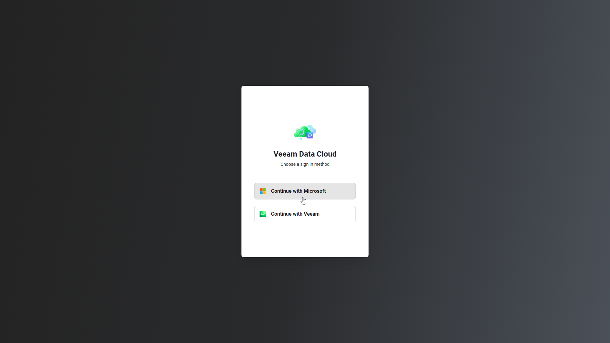
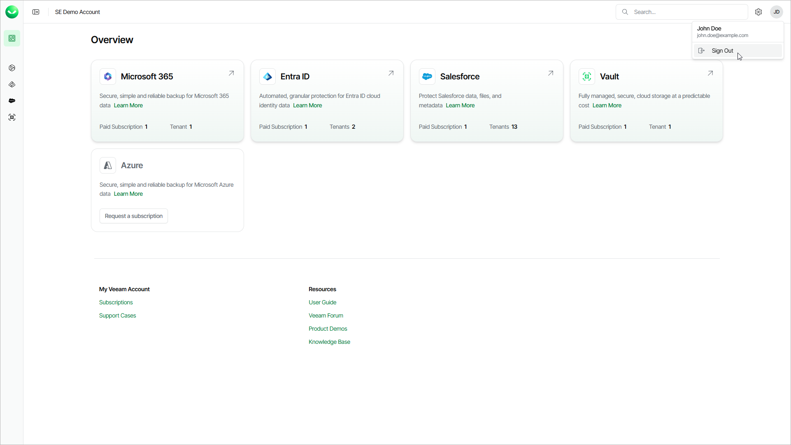

# Accessing Veeam Data Cloud

In this article

Before you can start using Veeam Data Cloud, make sure you have a Veeam account and an active subscription. After your subscription is activated, you will receive an email invitation to your newly created Veeam Data Cloud organization. Follow the link in the invitation to log in to Veeam Data Cloud and start using the service.

Getting Access to Veeam Data Cloud

To obtain access to Veeam Data Cloud, follow these steps:

1. If you do not have a Veeam account, sign up at the Veeam My Account Portal and specify a user who will be the license administrator for your company. For details, see [this Veeam KB article](https://www.veeam.com/kb4034).

The license administrator will become the first user of your Veeam Data Cloud organization.

1. Request a subscription to a Veeam Data Cloud workload through one of the Veeam sales channels. For details, see [Veeam Data Cloud Purchasing Options](https://www.veeam.com/products/veeam-data-cloud/purchasing-options.html).

Once your subscription is activated, you will receive an email with an invitation link to your Veeam Data Cloud organization.

1. Accept the invitation and log in to Veeam Data Cloud. For the first login to Veeam Data Cloud, use the Veeam My Account credentials of the license administrator. For details, see [Logging in to Veeam Data Cloud](accessing_vdc.md).

As the first user of your Veeam Data Cloud organization, accept Veeam Data Cloud terms and conditions to start working with Veeam Data Cloud. The first user of your Veeam Data Cloud organization is automatically assigned the OrganizationAdmin role, which allows them to manage users and perform all configuration actions.

Logging In to Veeam Data Cloud

To access Veeam Data Cloud, you can use the direct link to the Veeam Data Cloud portal that you received in your invitation email or go to the <https://cloud.veeam.com> webpage.

To log in to the Veeam Data Cloud portal, use your Veeam My Account credentials or your Microsoft 365 account.

|  |
| --- |
| Note |
| * Veeam Data Cloud supports the latest stable versions of Google Chrome, Microsoft Edge (Chromium only) and Mozilla Firefox browsers. * Veeam Data Cloud automatically logs you out after 30 minutes of inactivity and displays a notification two minutes before the session ends. |

Logging In with Invitation Link

To log in to Veeam Data Cloud using the link that you received in your invitation email, do the following:

1. In the invitation email that you received, click Accept Invitation.
2. On the Veeam Data Cloud portal, select your sign in method:

* Select Continue with Microsoft to log in with your Microsoft 365 account. You will be redirected to the Microsoft Entra authentication page.
* Select Continue with Veeam to log in with your Veeam My Account credentials. You will be redirected to the Sign in to Veeam authentication page.

1. Specify or select your credentials that you want to use to log in to Veeam Data Cloud.
2. If your account is a part of multiple Veeam Data Cloud organizations, on the Choose an Organization page, select an organization you want to manage.

Logging In with Portal URL

To log in to Veeam Data Cloud, do the following:

1. Open the <https://cloud.veeam.com> URL in your browser.
2. On the Veeam Data Cloud portal, select your sign in method:

* Select Continue with Microsoft to log in with your Microsoft 365 account. You will be redirected to the Microsoft Entra authentication page.
* Select Continue with Veeam to log in with your Veeam My Account credentials. You will be redirected to the Sign in to Veeam authentication page.

1. Specify or select your credentials that you want to use to log in to Veeam Data Cloud.
2. If your account is a part of multiple Veeam Data Cloud organizations, on the Choose an Organization page, select an organization you want to manage.

Logging Out

To log out, click the user name initials in the top-right corner of the Veeam Data Cloud page, and then click Sign Out.

Page updated 1/16/2026
