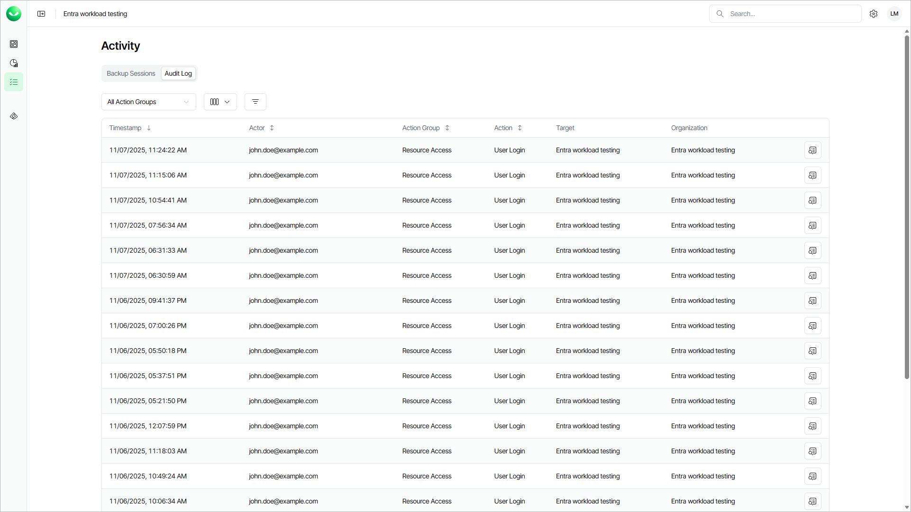

# Viewing Audit Logs

In this article

Veeam Data Cloud records all security-sensitive events and creates an audit log. In the Activity view, you can review a unified list of audit log events across all workloads within your Veeam Data Cloud organization. This helps you monitor security-sensitive activities and verify whether they comply with your security policies. The Activity view includes all events related to access management and resource access. For details, see [Audit Log Events](activity_audit_events.md).

When searching for events, you can apply quick filters to locate events assigned to a specific action group, or use advanced filtering options to view events for a specific workload, tenant, actor, or action type.

The Activity view with audit logs is available to users with the OrganizationAdmin role assigned.

To open the Activity view with audit logs, click the activity icon on the left and then click Audit Logs.

In the audit log list, Veeam Data Cloud displays the following properties for each audit log event:

| Property | Description |
| --- | --- |
| Timestamp | Time when the event occurred. |
| Actor | User who initiated the action. |
| Action Group | Group to which the event action is assigned. |
| Action | Action type of the event. For more information on event types, see [Audit Log Events](activity_audit_events.md). |
| Target | Object that is affected by the action. For example, a user, tenant, backup policy or organization. |
| Organization | Organization for which the action was performed. |

You can view detailed information for each event, including Target ID and Organization ID. This information can be useful when you want to provide [Veeam Customer Support](https://my.veeam.com/my-cases) with details of a specific event.

To view the detailed information, click View Details next to the audit log event.

Filtering Data

To quickly find certain audit log events, you can apply a quick filter by action group or combine advanced filters by the Organization, Workload Type, Tenant, Action Group, Action, Status and Actor criteria.

* To apply the quick filter, click All Actions Group and select one or more groups.
* To apply the advanced filters, do the following:

1. Click Filters.
2. In the Filters window, select one or more values for the required criteria.
3. Click Apply to view the list of audit log events which match the specified filters.

To remove the filters and view all events, click Clear Filters.

Page updated 11/14/2025
