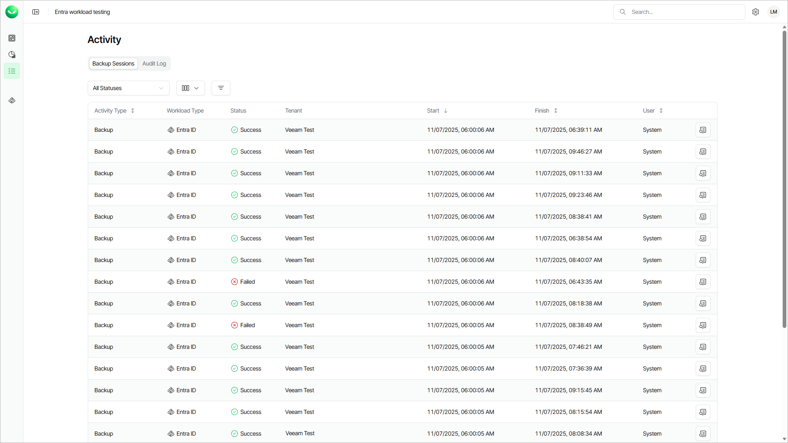

# Viewing Backup Sessions

In this article

For each data protection operation, Veeam Data Cloud starts a new backup session according to created backup policies. In the Activity view, you can review all running and completed backup sessions across all workloads within your Veeam Data Cloud organization. This helps you shorten your response time to issues and simplifies prevention and troubleshooting of potential problems.

When searching for backup sessions, you can apply quick filters to locate sessions with errors or warnings, or use advanced filtering options to view sessions for a specific workload, tenant, or actor.

To open the Activity view with backup sessions, click the activity icon on the left.

In the backup session list, Veeam Data Cloud displays the following properties for each backup session:

| Property | Description |
| --- | --- |
| Activity Type | Type of the session. |
| Workload Type | Workload type that the session backs up. |
| Status | Current state of the session. To view detailed information, click View Details next to the backup session. |
| Organization | Organization for which the session was started. By default, the Organization column is not displayed in the list. To display it, click Column visibility and select Organization. |
| Tenant | Tenant for which the session was started. |
| Start | Time when the session was started. |
| Finish | Time when the session was completed. |
| User | User that triggered the backup session. If the property value is System, the session was triggered automatically according to the schedule. |

You can view detailed information for each backup session, including Organization ID, Tenant ID and Policy ID. This information can be useful when you want to understand why a backup session failed or provide [Veeam Customer Support](https://my.veeam.com/my-cases) with details of a specific backup session.

To view the detailed information, click View Details next to the backup session.

Filtering Data

To quickly find certain backup sessions, you can apply a quick filter by sessions status or combine filters by the Organization, Workload Type, Tenant, Status and Actor criteria.

* To apply the quick filter, click All Statuses and select one or more statuses.
* To apply the advanced filters, do the following:

1. Click Filters.
2. In the Filters window, select one or more values for required criteria.
3. Click Apply to view the list of backup sessions which match the specified filters.

To remove the filters and view all sessions, click Clear Filters.

Page updated 11/14/2025
