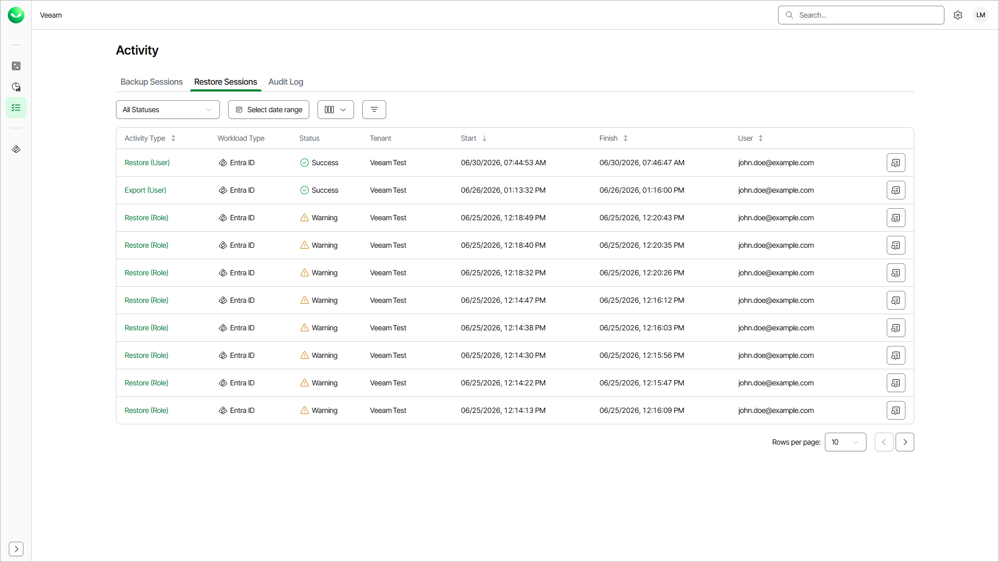

# Viewing Restore Sessions

For each restore operation, Veeam Data Cloud starts a new restore session according to the restore configuration. On the Activity page, you can review all running and completed restore sessions across all workloads within your Veeam Data Cloud organization. This helps you quickly identify failed or warning sessions and take corrective action.

|  |
| --- |
| Note |
| The Activity page currently supports the Microsoft 365, Microsoft Azure, Entra ID and Salesforce workloads.  For the Microsoft Azure workload, only events related to VM and SQL backup policies are supported. |

To open the Activity page with restore sessions, click the activity icon on the left and click Restore Sessions.

When you search for restore sessions, you can apply quick filters to locate sessions with errors or warnings or use advanced filtering options to view sessions for a specific workload, tenant or actor.

In the restore session list, Veeam Data Cloud displays the following properties for each restore session:

Viewing Restore Sessions

| Property | Description |
| Activity Type | Type of the session. |
| Workload Type | Workload type that the session restores. |
| Status | Current status of the session. |
| Organization | Organization for which the session was started. By default, the Organization column is not displayed in the list. To display it, click Column visibility and select Organization. |
| Tenant | Tenant for which the session was started. |
| Start | Time when the session was started. |
| Finish | Time when the session was completed. |
| User | User that triggered the restore session. |

You can view detailed information for each restore session, including Organization ID, Tenant ID and Policy ID. This information can be useful when you want to understand why a restore session failed or provide [Veeam Customer Support](https://my.veeam.com/my-cases) with details of a specific backup session.

To view the detailed information, click View Details next to the restore session.

Filtering Data

To quickly find certain restore sessions, you can apply a quick filter by session status or combine filters by the Organization, Workload Type, Tenant, Status and Actor criteria.

* To apply the quick filter, click All Statuses and select one or more statuses.
* To apply the advanced filters, do the following:

1. Click Filters.
2. In the Filters window, select one or more values for the desired criteria.
3. Click Apply to view the list of backup sessions that match the specified filters.

To remove the filters and view all sessions, click Clear Filters.

Page updated 2026-07-24
