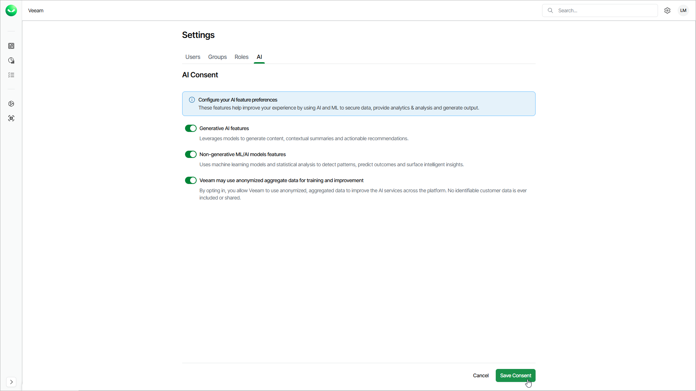

# Configuring AI Consent

Veeam Data Cloud uses generative AI, non-generative AI and machine learning (ML) features to enhance data protection workflows. To comply with AI legal requirements and foster trust, Veeam Data Cloud requires your explicit consent before you use AI features for your organization.

When you log in to your new Veeam Data Cloud organization for the first time, you are prompted to provide consent for AI features. You can change AI consent settings at any time to enable or disable specific AI features, and to control whether Veeam can use anonymized data to improve its services. To configure AI consent settings, log in to Veeam Data Cloud with an account that has the OrganizationAdmin role assigned. By default, all AI features are enabled for your organization.

You can configure your consent for the following AI options:

* Generative AI features — Veeam Data Cloud generative AI models allow you to ask questions in natural language and receive contextual, actionable answers. Regardless of your consent, you have access to the Veeam Intelligence chatbot.
* Non-generative ML/AI models features — Veeam Data Cloud non-generative AI and machine learning allow you to use advanced threat and ransomware detection for your Microsoft 365 tenants.
* Veeam may use anonymized aggregate data for training and improvement — anonymized, aggregated data improves threat detection models, reduces false positives, and expands detection to new threat types and zero-day attacks. Before Veeam uses any data for training, all identifying information such as customer names, account IDs, organization details and user names is removed and patterns are combined across many customers. No individual customer data can be identified or reconstructed.

To configure the AI consent settings, do the following:

1. Click the settings icon in the top-right corner.
2. Select AI.
3. On the AI tab, set the toggle next to the option for which you want to change your consent to On or Off.
4. Click Save Consent to apply the changes.

|  |
| --- |
| NOTE |
| Changes to AI consent settings may take up to 24 hours to take effect across all Veeam Data Cloud services. |

