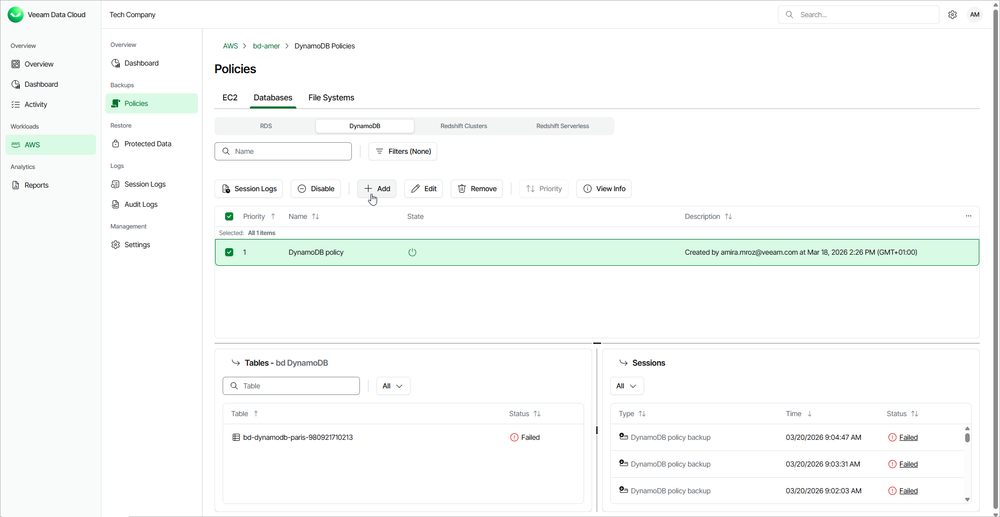

# Step 1. Launch Add DynamoDB Policy Wizard

To launch the Add DynamoDB Policy wizard, do the following:

1. On the AWS page, locate a tenant that has access to resources that you want to back up, and click Manage in the Actions column.

1. On the tenant administration page, navigate to Policies > Databases > DynamoDB and click Add.

