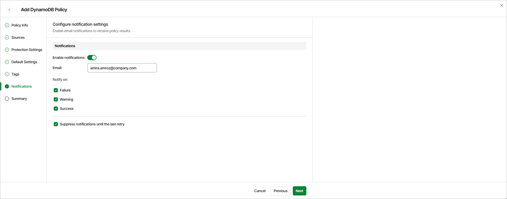

# Step 7. Specify Notification Settings

[This step applies only if you have enabled advanced settings at the Summary step of the wizard]

At the Notifications step of the wizard, you can instruct Veeam Data Cloud for AWS to send notifications by email in case of backup failure, success or warning. To do that, set the Enable notifications toggle to On. Then, specify an email address of a recipient in the Email field.

Use a semicolon to separate multiple recipient addresses. Do not use spaces after semicolons between the specified email addresses.

