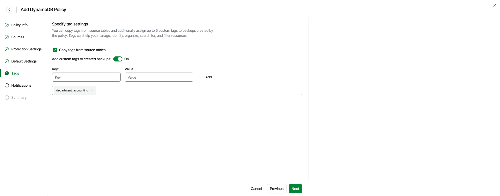

# Step 6. Enable AWS Tags Assignment

[This step applies only if you have enabled advanced settings at the Summary step of the wizard]

At the Tags step of the wizard, you can choose whether you want to assign to cloud-native backups of the selected DynamoDB tables already existing tags and your own custom tags.

If you set the Add custom tags to created backups toggle to On, you must also specify the tags explicitly. To do that, use the Key and Value fields to specify a key and a value for the new custom AWS tag, and then click Add. Note that you cannot add more than 5 custom tags.

