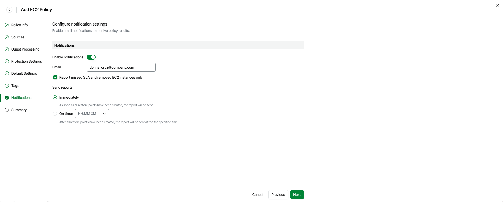

# Step 8. Specify Notification Settings

[This step applies only if you have enabled advanced settings at the Summary step of the wizard]

At the Notifications step of the wizard, you can instruct Veeam Data Cloud for AWS to send notifications by email in case of backup failure, success or warning. To do that:

1. Set the Enable notifications toggle to On.
2. In the Email field, specify an email address of a recipient.

Use a semicolon to separate multiple recipient addresses. Do not use spaces after semicolons between the specified email addresses.

1. Select the Report missed SLA and removed EC2 instances only check box if you want Veeam Data Cloud for AWS to send email notifications only in case the backup policy fails to meet SLA target value, or if any EC2 instances added to the policy are [considered removed](aws_sla_calculation.md) from AWS.
2. Use the Send reports setting to define whether you want Veeam Data Cloud for AWS to send email notifications immediately after all the restore points have been created, or at a specific time.

