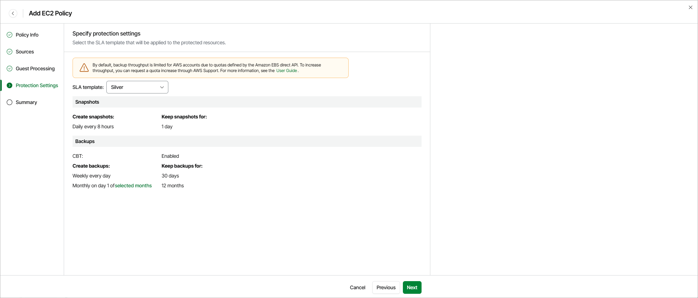

# Step 5. Specify Protection Settings

By design, Veeam Data Cloud for AWS comes with predefined SLA templates that help eliminate error-prone manual steps and save time configuring backup policies:

* Gold — provides the highest backup frequency and longest retention: cloud-native snapshots are created every hour and retained for 1 day, daily image-level backups are created every 8 hours and retained for 30 days, weekly image-level backups are created once per day and retained for 90 days, monthly image-level backups are created on the first day of each month and retained for 24 months.
* Silver — provides the medium backup frequency and mid-range retention: cloud-native snapshots are created every 8 hours and retained for 1 day, weekly image-level backups are created once per day and retained for 30 days, monthly image-level backups are created on the first day of each month and retained for 12 months.
* Bronze — provides the lowest backup frequency and shortest retention: cloud-native snapshots are created every 24 hours and retained for 7 days, weekly image-level backups are created every Monday and retained for 30 days, monthly image-level backups are created on the first day of each month and retained for 12 months.

At the Protection Settings step of the wizard, select an SLA template that will be assigned to the policy and applied to the protected EC2 instances. To learn how the SLA compliance ratio is calculated, see [How Veeam Data Cloud for AWS Estimates SLA Compliance](aws_sla_calculation.md).

|  |
| --- |
| Note |
| The SLA templates have the changed block tracking (CBT) mechanism enabled. This mechanism is used during image-level backup creation to reduce the amount of data read from processed EBS volumes, and to increase the speed and efficiency of incremental backups. For more information, see [Changed Block Tracking](cbt.md). |

Health Check for Restore Points

On the last day of each month, Veeam Data Cloud for AWS performs a health check for backup restore points created by all backup policies. During the health check, Veeam Data Cloud for AWS performs an availability check for data blocks in the whole regular backup chain, and a cyclic redundancy check (CRC) for metadata to verify its integrity. The health check helps you ensure that the restore points are consistent and that you will be able to restore data using these restore points. For more information on the health check, see [How Health Check Works](aws_how_health_check_works.md).

Related Topics

[How Backup Works](aws_backup_hiw_ec2.md)

