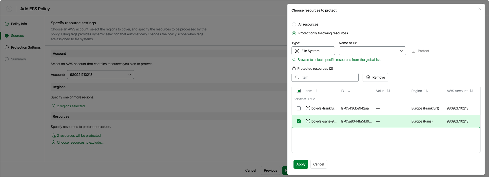

# Step 3. Configure Backup Source Settings

At the Sources step of the wizard, select an AWS account that contains EFS file systems you plan to protect, specify AWS Regions where file systems reside and choose file systems to back up.

Step 3a. Specify AWS Account

In the Accounts section of the Sources step of the wizard, select the AWS account to which the EFS file systems you plan to protect belong. For an AWS account to be displayed in the list of available accounts, it must be included into the tenant as described in section [Adding Tenants](aws_tenant_scope.md).

|  |
| --- |
| Note |
| To perform the backup operation, Veeam Data Cloud for AWS uses the permissions of the IAM role that was created in the AWS account during [CloudFormation template deployment](aws_tenant_connection.md). |

Step 3b. Select AWS Regions

In the Regions section of the Sources step of the wizard, select AWS Regions where EFS file systems that you plan to back up reside:

1. Click Choose regions.
2. In the Choose regions window, select the necessary AWS Regions from the Available Regions list, and click Add.
3. To save changes made to the backup policy settings, click Apply.

Step 3c. Select Redshift Clusters

In the Resources section of the Sources step of the wizard, specify the backup scope — select EFS file systems that Veeam Data Cloud for AWS will back up:

1. Click Choose resources to protect.
2. In the Choose resource to protect window, choose whether you want to back up all EFS file systems from AWS Regions selected at [step 3b](#regions) of the wizard or only specific file systems.

If you select the All resources option, Veeam Data Cloud for AWS will regularly check for new EFS file systems launched in the selected regions and automatically update the backup policy settings to include these file systems into the backup scope.

If you select the Protect only following resources option, you must also specify the file systems explicitly:

1. Use the Type drop-down list to choose whether you want to add individual EFS file systems or AWS tags to the backup scope.

If you select the Tag option, Veeam Data Cloud for AWS will back up only those EFS file systems that have specific tags and reside in the selected regions.

1. Use the Name or ID drop-down list to find the necessary resource, and then click Protect to add the resource to the backup scope.

For a resource to be displayed in the list of available resources, it must reside in an AWS Region that has ever been specified in any backup policy. Otherwise, the only option to discover the available resources is to click Browse to select specific resources from the global list and to wait for Veeam Data Cloud for AWS to populate the resource list.

|  |
| --- |
| Tip |
| You can simultaneously add multiple resources to the backup scope. To do that, click Browse to select specific resources from the global list, select check boxes next to the necessary EFS file systems or AWS tags in the list of available resources, and then click Protect.  If the list does not show the resources that you want to back up, click Rescan to launch the data collection process. As soon as the process is over, Veeam Data Cloud for AWS will update the resource list. |

If you add an AWS tag to the backup scope, Veeam Data Cloud for AWS will regularly check for new EFS file systems assigned the added AWS tag and automatically update the backup policy settings to include these file systems in the scope. However, this applies only to file systems from the AWS Regions selected at [step 3b](#regions) of the wizard. If you select a tag assigned to EFS file systems from other regions, these file systems will not be protected by the backup policy. To work around the issue, either go back to step 3b and add the missing regions, or create a new backup policy.

1. To save changes made to the backup policy settings, click Apply.

