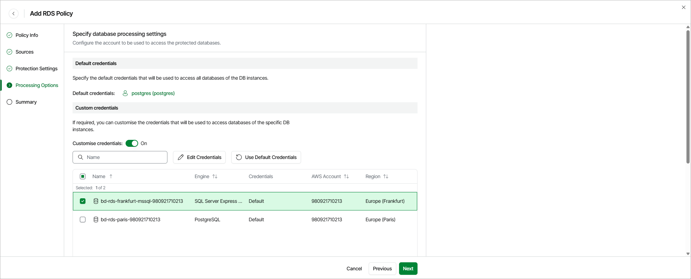

# Step 5. Specify Specify Processing Settings

At the Processing Options step of the wizard, select a database account whose credentials will be used to authenticate against databases of the DB instances added to the backup scope. For an account to be displayed in the list of available accounts, it must be added to Veeam Data Cloud for AWS as described in section [Adding Database Accounts](aws_settings_adding_database_accounts.md). If you have not added the necessary account to Veeam Data Cloud for AWS beforehand, you can do it without closing the Add RDS Policy wizard. To do that, click Add and complete the Add Account wizard.

By default, the selected account will be used to access all databases of the DB instances added to the backup policy. You can also granularly specify credentials that Veeam Data Cloud for AWS will use to access databases of specific DB instances. To do that, set the Customize credentials toggle to On, choose a DB instance for which you want to specify the credentials and click Edit Credentials.

|  |
| --- |
| Important |
| For Veeam Data Cloud for AWS to be able to protect DB instances added to the backup policy, the selected account must exist on these instances. |

