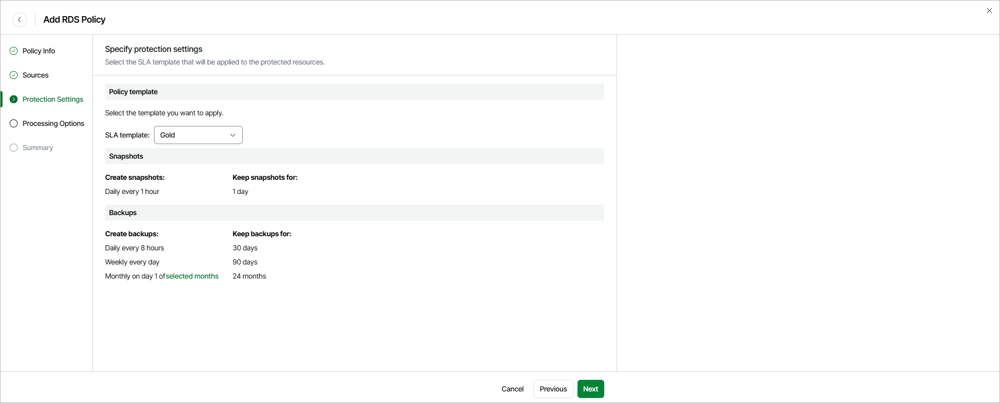

# Step 4. Specify Protection Settings

By design, Veeam Data Cloud for AWS comes with predefined SLA templates that help eliminate error-prone manual steps and save time configuring backup policies:

* Gold — provides the highest backup frequency and longest retention: cloud-native snapshots are created every hour and retained for 1 day, daily image-level backups are created every 8 hours and retained for 30 days, weekly image-level backups are created once per day and retained for 90 days, monthly image-level backups are created on the first day of each month and retained for 24 months.
* Silver — provides the medium backup frequency and mid-range retention: cloud-native snapshots are created every 8 hours and retained for 1 day, weekly image-level backups are created once per day and retained for 30 days, monthly image-level backups are created on the first day of each month and retained for 12 months.
* Bronze — provides the lowest backup frequency and shortest retention: cloud-native snapshots are created every 24 hours and retained for 7 days, weekly image-level backups are created every Monday and retained for 30 days, monthly image-level backups are created on the first day of each month and retained for 12 months.

At the Protection Settings step of the wizard, select an SLA template that will be assigned to the policy and applied to the protected RDS resources.

|  |
| --- |
| Notes |
| * The SLA templates have the changed block tracking (CBT) mechanism enabled. This mechanism is used during image-level backup creation to reduce the amount of data read from processed EBS volumes, and to increase the speed and efficiency of incremental backups. For more information, see [Changed Block Tracking](cbt.md). * Due to technical limitations, Veeam Data Cloud for AWS does not estimate the SLA compliance ratio for RDS resources. When an SLA template is assigned to an RDS policy, Veeam Data Cloud for AWS uses only the schedule and retention settings defined in the template. |

Health Check for Restore Points

On the last day of each month, Veeam Data Cloud for AWS performs a health check for backup restore points created by all backup policies. During the health check, Veeam Data Cloud for AWS performs an availability check for data blocks in the whole regular backup chain, and a cyclic redundancy check (CRC) for metadata to verify its integrity. The health check helps you ensure that the restore points are consistent and that you will be able to restore data using these restore points. For more information on the health check, see [How Health Check Works](aws_how_health_check_works_rds.md).

Considerations and Limitations

For Veeam Data Cloud for AWS to be able to create an image-level backup, the following conditions must be met:

* The DNS resolution option must be enabled for the VPC network. For more information, see [AWS Documentation](https://docs.aws.amazon.com/vpc/latest/userguide/create-vpc.html#Create-VPC).
* As Veeam Data Cloud for AWS uses public access for communication between components, the public IPv4 addressing attribute must be enabled at least for one subnet in the Availability Zone where the DB instance resides and the VPC network to which the subnet belongs must have an internet gateway attached. VPC network and subnet route tables must have routes that direct internet-bound traffic to this internet gateway.

If the RDS resources added to the backup scope operate in a private network (that is, connected to subnets with auto-assignment of public IPv4 addresses disabled), configure VPC interface endpoints as described in section [How to Configure Endpoints in AWS](aws_configure_endpoints.md).

Related Topics

[How Backup Works](aws_backup_hiw_rds.md)

