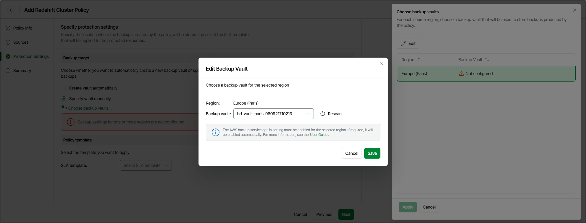
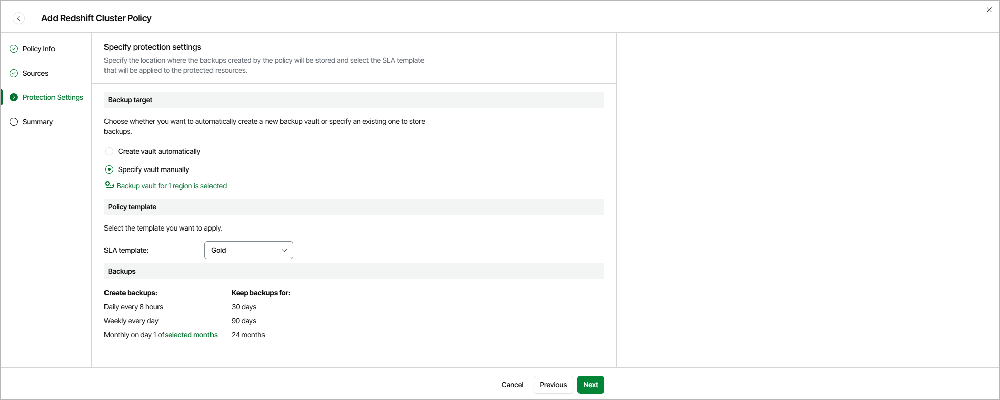

# Step 4. Specify Protection Settings

At the Protection Settings step of the wizard, specify target locations where Veeam Data Cloud for AWS will store Redshift backups and select an SLA template that will be assigned to the policy and applied to the protected Redshift clusters.

Configuring Backup Target Settings

In the Backup target section, choose whether you want Veeam Data Cloud for AWS to automatically create backup vaults that will be used to store backups of the selected Redshift clusters, or to specify backup vaults manually.

If you select the Create vault automatically option, Veeam Data Cloud for AWS will check for existing backup vaults in each AWS Region included in the policy. If there is no backup vault, Veeam Data Cloud for AWS will automatically create a vault to store backups of the selected Redshift clusters in that region.

If you select the Select vault manually option, you must explicitly specify the vaults for each AWS Region included in the policy:

1. Click Choose backup vaults.

1. In the Choose backup vaults window, do the following:

1. Select an AWS Region and click Edit.
2. In the Edit Backup Vault window, from the Backup vault drop-down list, select the necessary backup vault.

For a backup vault to be displayed in the list of available backup vaults, it must be created in the AWS Backup console as described in [AWS Documentation](https://docs.aws.amazon.com/aws-backup/latest/devguide/create-a-vault.html#creating-a-vault-console). If no custom backup vaults exist in the selected AWS Region, the list will contain the default backup vault only.

|  |
| --- |
| Important |
| * Veeam Data Cloud for AWS does not support storing backups in [logically air-gapped vaults](https://docs.aws.amazon.com/aws-backup/latest/devguide/logicallyairgappedvault.html) and in backup vaults with the [AWS Backup Vault Lock](https://docs.aws.amazon.com/aws-backup/latest/devguide/vault-lock.html) feature enabled.  * Make sure policies assigned to the selected backup vault allow Veeam Data Cloud for AWS to access vault resources and to perform backup and restore operations, as well as to remove backups. For more information on vault access policies, see [AWS Documentation](https://docs.aws.amazon.com/aws-backup/latest/devguide/create-a-vault-access-policy.html).  * For Veeam Data Cloud for AWS to be able to back up Redshift clusters, you must enable the Opt-in service for the Redshift resource type in the AWS Backup settings. Otherwise, Veeam Data Cloud for AWS will automatically enable the service for each AWS Region specified in the Backups section in your AWS account while performing backup operations. |

1. Click Save.

1. To save changes made to the backup policy settings, click Apply.

Choosing SLA Template

By design, Veeam Data Cloud for AWS comes with predefined SLA templates that help eliminate error-prone manual steps and save time configuring backup policies:

* Gold — provides the highest backup frequency and longest retention: cloud-native backups are created every 8 hours and retained for 30 days, weekly backups are created once per day and retained for 90 days, monthly backups are created on the first day of each month and retained for 24 months.
* Silver — provides the medium backup frequency and mid-range retention: cloud-native backups are created every 8 hours and retained for 1 day, weekly backups are created once per day and retained for 30 days, monthly backups are created on the first day of each month and retained for 12 months.
* Bronze — provides the lowest backup frequency and shortest retention: cloud-native backups are created every 24 hours and retained for 7 days, weekly backups are created every Monday and retained for 30 days, monthly backups are created on the first day of each month and retained for 12 months.

In the Policy template section, select an SLA template that will be assigned to the policy and applied to the protected Redshift clusters.

|  |
| --- |
| Note |
| Due to technical limitations, Veeam Data Cloud for AWS does not estimate the SLA compliance ratio for Redshift clusters. When an SLA template is assigned to a Redshift policy, Veeam Data Cloud for AWS uses only the schedule and retention settings defined in the template. |

Related Topics

[How Backup Works](aws_backup_hiw_redshift.md)

