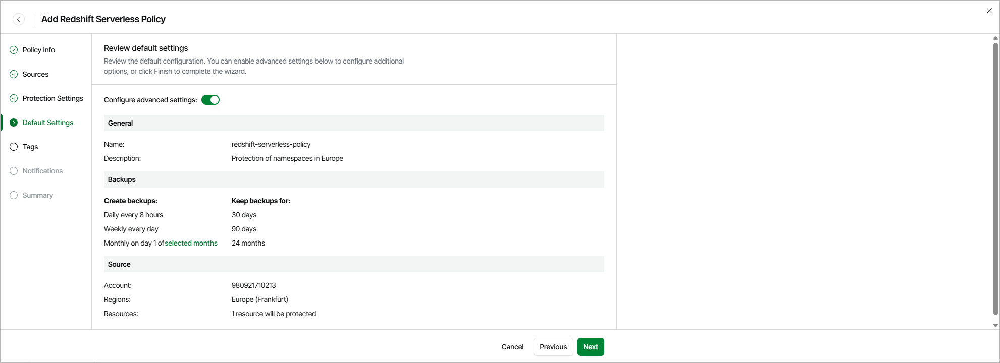

# Step 5. Review Default Settings

At the Summary step of the wizard, you can do either of the following:

* To complete the wizard with the default settings, click Finish.
* To configure additional settings (such as assigning tags to cloud-native backups and receiving backup policy results by email), set the Advanced settings toggle to On. Then, click Next.

