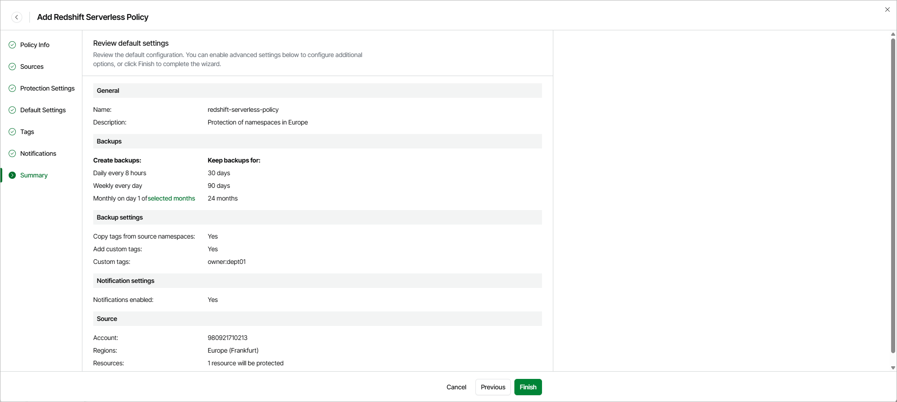

# Step 8. Finish Working with Wizard

[This step applies only if you have enabled advanced settings at the Summary step of the wizard]

At the Summary step of the wizard, review configuration information and click Finish.

