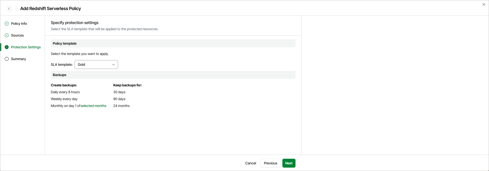

# Step 4. Specify Protection Settings

By design, Veeam Data Cloud for AWS comes with predefined SLA templates that help eliminate error-prone manual steps and save time configuring backup policies:

* Gold — provides the highest backup frequency and longest retention: cloud-native backups are created every 8 hours and retained for 30 days, weekly backups are created once per day and retained for 90 days, monthly backups are created on the first day of each month and retained for 24 months.
* Silver — provides the medium backup frequency and mid-range retention: cloud-native backups are created every 8 hours and retained for 1 day, weekly backups are created once per day and retained for 30 days, monthly backups are created on the first day of each month and retained for 12 months.
* Bronze — provides the lowest backup frequency and shortest retention: cloud-native backups are created every 24 hours and retained for 7 days, weekly backups are created every Monday and retained for 30 days, monthly backups are created on the first day of each month and retained for 12 months.

At the Protection Settings step of the wizard, select an SLA template that will be assigned to the policy and applied to the protected Redshift Serverless namespaces.

|  |
| --- |
| Note |
| Due to technical limitations, Veeam Data Cloud for AWS does not estimate the SLA compliance ratio for Redshift Serverless namespaces. When an SLA template is assigned to a Redshift Serverless policy, Veeam Data Cloud for AWS uses only the schedule and retention settings defined in the template. |

Related Topics

[How Backup Works](aws_backup_hiw_redshift_serverless.md)

