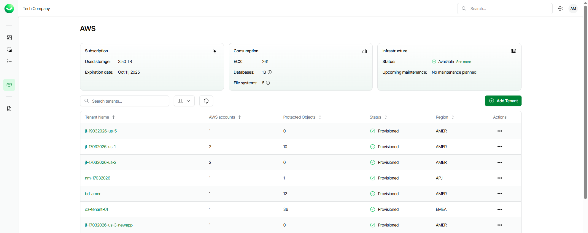
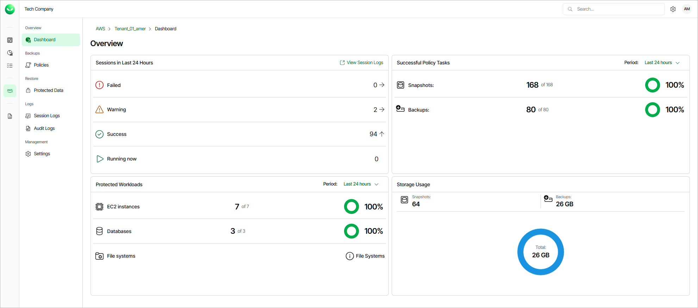

# Viewing Dashboards

Veeam Data Cloud for AWS comes with 2 dashboards that allow you to monitor the Veeam Data Cloud for AWS environment for all tenants added to the product, as well as track data protection activity and backup performance for a specific tenant.

Home Page Dashboard

The dashboard on the AWS page provides an overview of your Veeam Data Cloud for AWS environment for all tenants added to the product. The dashboard includes the following widgets:

* Subscription — displays the amount of storage space currently consumed by restore points created by Veeam Data Cloud for AWS in backup repositories, as well as the date when your subscription will expire.
* Consumption — displays the number of AWS resources currently protected with Veeam Data Cloud for AWS.
* Infrastructure — displays the health state of the Veeam Data Cloud for AWS infrastructure, as well as the planned date for installing available updates (if any).

To view all upcoming maintenance that may affect backup performance, click See more next to the Upcoming maintenance field. For more information, see [Veeam Data Cloud Maintenance](maintenance.md).

For each tenant that is added to Veeam Data Cloud for AWS, the AWS page also displays a set of properties, such as:

* Tenant Name — the name of the tenant.

* AWS Account — the number of AWS accounts that are included into the tenant.

* Protected Objects — the total number of AWS resources that are protected by backup policies created for this tenant.
* Status — the status that indicates whether the tenant is provisioned.

* Region — the AWS Region where Veeam Data Cloud for AWS performs administrative activities (such as coordinating snapshot and backup creation, executing recovery operations and managing retention tasks) for the tenant.

Administration Dashboard

The dashboard on the tenant administration page provides at-a-glance real-time overview of all protected AWS resources and allows you to estimate the overall backup performance for a specific tenant. The dashboard includes the following widgets:

* Sessions in Last 24 Hours — displays the number of sessions started for data protection or disaster recovery operations during the past 24 hours that completed successfully, the number of sessions that completed with warnings, the number of sessions that completed with errors, and the number of sessions that are currently running.

To get more information on the sessions, click either View Session Logs or any of the widget rows. In the latter case, the Session Logs page will show only those sessions that have the same status as that clicked in the widget.

For more information on the Session Logs page, see [Viewing Logs](aws_logs.md#session_logs).

* Successful Policy Tasks — displays the number of snapshots and backups successfully created by backup policies during a specific time period (the past 24 hours by default).

To specify the time period, click the link next to the Schedule icon. To get more information on the created snapshots or backups, click any of the widget rows. In the latter case, the Session Logs page will show only those sessions during which Veeam Data Cloud for AWS created the same items as that clicked in the widget.

For more information on the Session Logs page, see [Viewing Logs](aws_logs.md#session_logs).

* Protected Workloads — displays the number of AWS resources protected by Veeam Data Cloud for AWS during a specific time period (the past 24 hours by default).

To specify the time period, click the link next to the Schedule icon. To get more information on the protected resources, click any of the widget rows.

* Storage Usage — displays the amount of storage space that is currently consumed by restore points created by Veeam Data Cloud for AWS in backup repositories.

