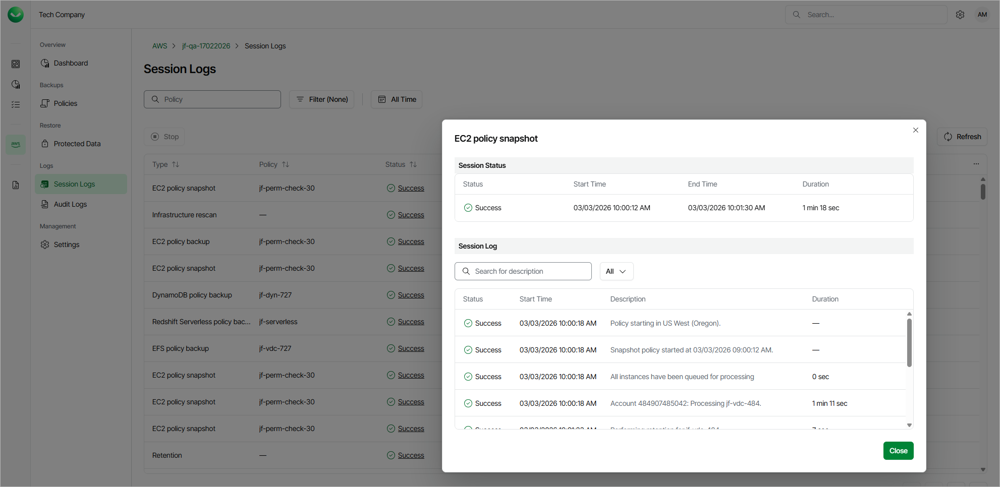
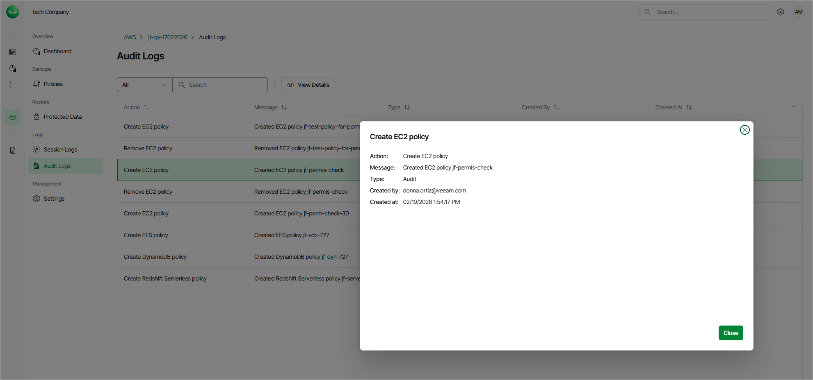

# Viewing Logs

Veeam Data Cloud for AWS allows you to track real-time statistics of all operations and view all user actions. To do that:

1. On the AWS page, locate a tenant that has access to the backed-up resources, and click Manage in the Actions column.
2. On the tenant administration page, navigate to Session Logs or Audit Logs.

Viewing Session Logs

On the Session Logs page, you can track real-time statistics of all running and completed operations. To view the full list of tasks executed during an operation, select the necessary session and click View Details. Alternatively, you can click the link in the Status column.

Viewing Audit Logs

On the Audit Logs page, you can view a list of all actions performed by the user. To see details for a specific action, select the necessary action and click View Details.

