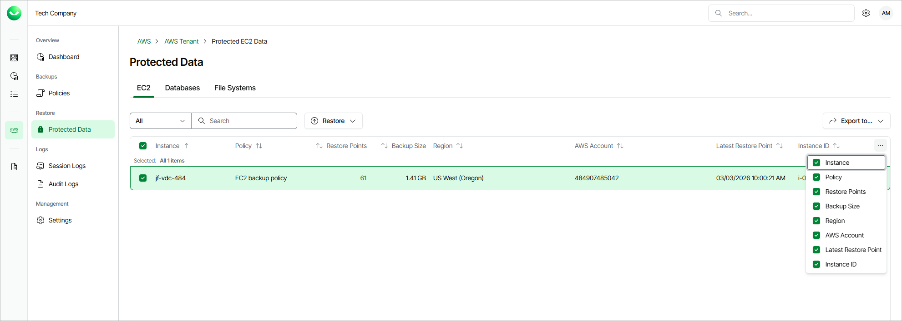

# Viewing Backed-Up Data

After a backup policy successfully creates a restore point for an AWS resource according to the specified SLA template, the resource is automatically added to the resource list on the Protected Data page. To view the resource list, do the following:

1. On the AWS page, locate a tenant that has access to the backed-up resources, and click Manage in the Actions column.
2. On the tenant administration page, navigate to Protected Data.

For each backed-up AWS resource, Veeam Data Cloud for AWS creates a record in the configuration database with the following set of properties, such as:

* Policy — the name of the backup policy that processed the resource.
* Restore Points — the number of restore points created for the resource.

To view the list of restore points, click the link in the Restore Points column. The Available Restore Points window will display information on each restore point, including the following: the date when the restore point was created, the type of the restore point, the region where the restore point is stored, the state of the restore point (for image-level backups), and the configured retention policy settings (D — daily, W — weekly, M — monthly or Y — yearly).

* Latest Restore Point — the date and time of the latest restore point that was created for the resource.

* Region — the AWS Region in which the resource resides.

* AWS Account — the AWS account to which the resource belongs.

On the Protected Data page, you can also restore data of backed-up EC2 instances, RDS resources, DynamoDB tables, Redshift clusters, Redshift Serverless namespaces, EFS and FSx file systems. For more information, see sections [EC2 Restore](aws_restore_ec2.md), [RDS Restore](aws_restore_rds.md), [DynamoDB Restore](aws_dynamo_restore.md), [Redshift Restore](aws_redshift_restore.md), [Redshift Serverless Restore](aws_redshift_serverless_restore.md), [EFS Restore](aws_efs_restore.md) and [FSx Restore](aws_fsx_restore.md).

