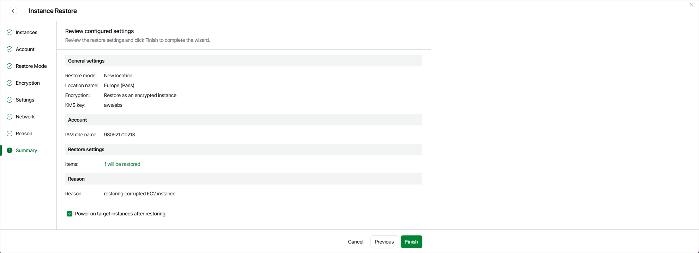

# Step 9. Finish Working with Wizard

At the Summary step of the wizard, review summary information and click Finish.

|  |
| --- |
| Tip |
| If you want to start the restored EC2 instance as soon as the restore process completes, select the Power on target instance after restoring check box. |

If you have selected the Restore to original location option at the Restore Mode step of the wizard, Veeam Data Cloud for AWS will verify whether the original instance profile attached to the restored EC2 instance still exists in the AWS infrastructure, and whether the original IAM role associated with this profile has not been replaced, modified or removed. If any of the conditions is not met, you will receive a warning in the Instance Profile Issue window. To work around the issue, you can do either of the following:

* If the instance profile does not exist in the AWS infrastructure anymore, go back to [step 5](aws_restore_ec2_entire_mode.md), select the Restore to new location, or with different settings option and follow the instructions provided in section [Performing EC2 Instance Restore](aws_restore_ec2_entire_type.md).
* If the IAM role associated with the instance profile has been replaced, modified or removed, go back to [step 5](aws_restore_ec2_entire_mode.md), select the Restore to new location, or with different settings option and choose another instance profile as described in section [Performing EC2 Instance Restore](aws_restore_ec2_entire_type.md). Alternatively, click Finish to complete the restore session, and associate a new role in the AWS Management Console as described in [AWS Documentation](https://docs.aws.amazon.com/AWSEC2/latest/UserGuide/iam-roles-for-amazon-ec2.html#replace-iam-role).

