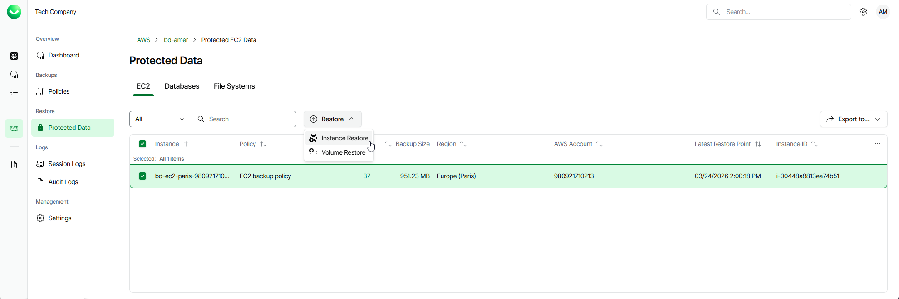

# Step 1. Launch Instance Restore Wizard

To launch the Instance Restore wizard, do the following.

1. On the AWS page, locate a tenant that has access to resources that you want to restore, and click Manage in the Actions column.
2. On the tenant administration page, navigate to Protected Data > EC2.
3. Select the EC2 instance that you want to restore, and click Restore > Instance Restore.

Alternatively, click the link in the Restore Points column. Then, in the  window, select the Available Restore Pointse necessary restore point and click Restore > Instance Restore.

|  |
| --- |
| Note |
| You can restore multiple EC2 instances if they belong to same AWS account only. |

