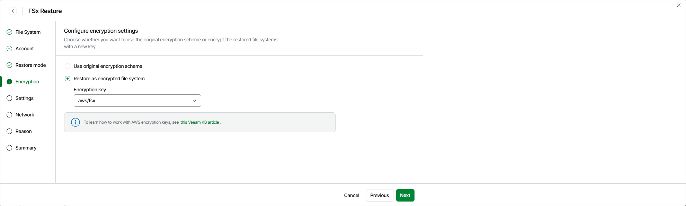

# Step 5. Enable Encryption

[This step applies only if you have selected the Restore to new location, or with different settings option at the Restore Mode step of the wizard]

At the Encryption step of the wizard, choose whether the restored file system will be encrypted with an AWS KMS key:

* If you want to apply the existing encryption scheme, select the Use original encryption scheme option.
* If you want to change the key that is used for file system encryption, select the Restore as encrypted file system option and choose the necessary KMS key from the Encryption key drop-down list.

For a KMS key to be displayed in the list of available encryption keys, it must be stored in the AWS Region selected at [step 4](aws_restore_mode_fsx.md) of the wizard, and the AWS account selected for the restore operation at [step 3](aws_restore_account_fsx.md) of the wizard must contain the IAM role with permissions to access the key. For more information on KMS keys, see [AWS Documentation](https://docs.aws.amazon.com/kms/latest/developerguide/create-keys.html).

|  |
| --- |
| Tip |
| If the necessary KMS key is not displayed in the list, or if you want to use a KMS key from an AWS account other than the AWS account to which the specified IAM role belongs, you can select Add custom key ARN from the Encryption key drop-down list, and specify the Amazon resource name (ARN) of the key in the Add Custom Key ARN window.  For Veeam Data Cloud for AWS to be able to encrypt the restored file system using the provided KMS key, the AWS account selected for the restore operation at [step 3](aws_restore_account_fsx.md) of the wizard must contain an IAM role with permissions to access the key. |

