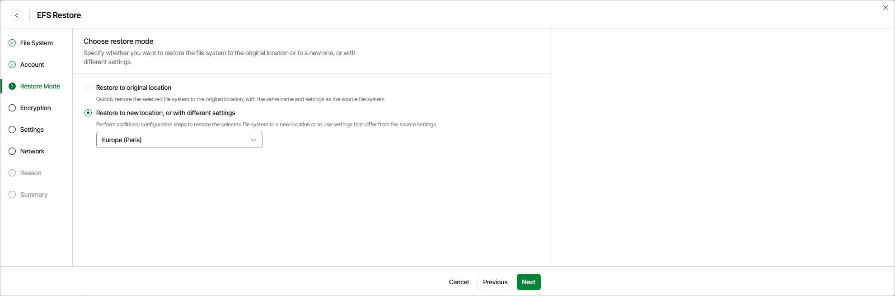

# Step 4. Choose Restore Mode

At the Restore Mode step of the wizard, choose whether you want to restore the selected EC2 instance to the original or to a custom location. If you select the Restore to new location, or with different settings option, specify the target AWS Region where the restored EC2 instance will operate.

|  |
| --- |
| Important |
| * If any of the restore options are not available, make sure that the selected restore points meet all the requirements listed at [step 2](aws_restore_ec2_entire_restore_point.md) of the wizard. * [Applies only if you select the Restore to new location, or with different settings option] If you restore EC2 instances from image-level backups, the list of available regions will contain the source region only. * Veeam Data Cloud for AWS does not support restore to the original location if the source EC2 instance is still present in the location and [stop protection](https://docs.aws.amazon.com/AWSEC2/latest/UserGuide/ec2-stop-protection.html) or [termination protection](https://docs.aws.amazon.com/AWSEC2/latest/UserGuide/terminating-instances.html#Using_ChangingDisableAPITermination) are enabled for the instance.   For more information on limitations and considerations, see [Before You Begin](aws_restore_ec2_entire_before_you_begin.md). |

