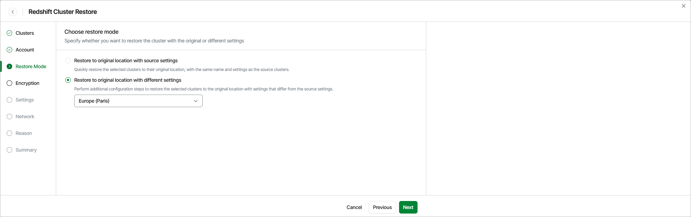

# Step 4. Choose Restore Mode

At the Restore Mode step of the wizard, choose whether you want to restore the selected Redshift cluster to the original location with the same or with different settings.

|  |
| --- |
| Important |
| If any of the restore options are not available, make sure that the selected restore points meet all the requirements listed at [step 2](aws_restore_point_redshift.md#restore_options). |

