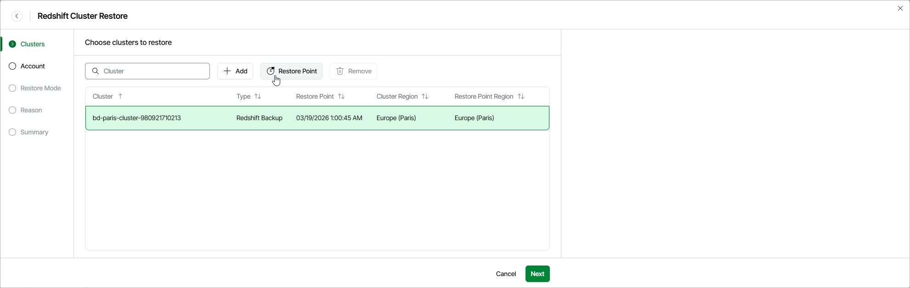

# Step 2. Select Restore Point

At the Clusters step of the wizard, you can add Redshift clusters to the restore session and select restore points to be used to perform the restore operation for each added cluster. By default, Veeam Data Cloud for AWS uses the most recent valid restore point. However, you can restore a cluster to an earlier state.

To select a restore point, do the following:

1. Select the cluster and click Restore Point.
2. In the Choose restore point window, select the necessary restore point and click Apply.

To help you choose a restore point, Veeam Data Cloud for AWS provides the following information on each available restore point:

* Date — the date when the restore point was created.
* Type — the type of the restore point.

* Restore Point Region — the AWS Region where the restore point is stored.

|  |
| --- |
| Important |
| * If you add Redshift clusters with the Multi-AZ deployment to the restore session, Veeam Data Cloud for AWS will restore these clusters with the Single-AZ deployment. * Since cross-region copying of Redshift backups is not supported for [Amazon Redshift](https://docs.aws.amazon.com/aws-backup/latest/devguide/backup-feature-availability.html#features-by-resource), some of [restore options](aws_restore_mode_redshift.md) may not be available. To work around the issue, is recommended that you select restore points stored in the same AWS Region where the source clusters reside if you plan to perform restore to the original location but with different settings. Otherwise, Veeam Data Cloud for AWS will be able to restore clusters belonging to different AWS Regions only to their original location with the source cluster settings. |

