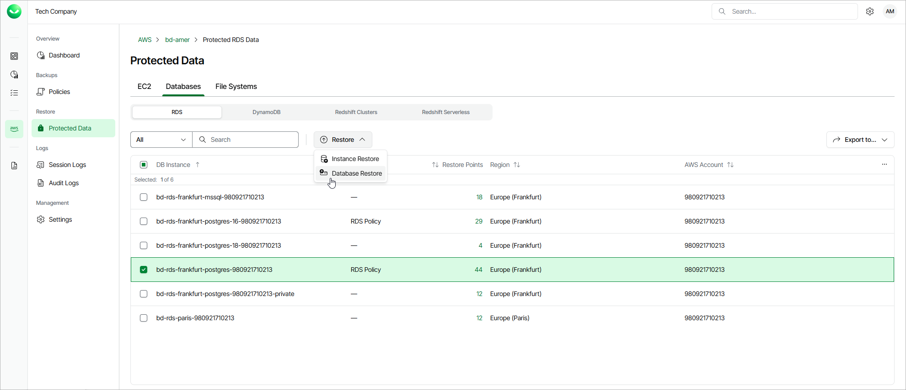

# Step 1. Launch RDS Database Restore Wizard

To launch the RDS Database Restore wizard, do the following.

1. On the AWS page, locate a tenant that has access to resources that you want to restore, and click Manage in the Actions column.
2. On the tenant administration page, navigate to Protected Data > Databases > RDS.
3. Select the DB instance whose databases you want to restore, and click Restore > Database Restore.

Alternatively, click the link in the Restore Points column. Then, in the Available Restore Points window, select the necessary restore point and click Restore > Database Restore.

