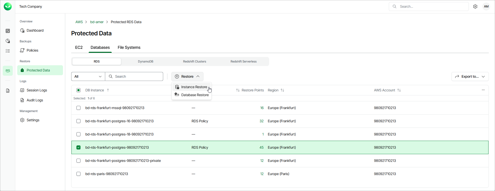

# Step 1. Launch RDS Restore Wizard

To launch the RDS Restore wizard, do the following:

1. On the AWS page, locate a tenant that has access to resources that you want to restore, and click Manage in the Actions column.
2. On the tenant administration page, navigate to Protected Data > Databases > RDS.
3. Select the RDS resource you want to restore, and click Restore > Instance Restore.

Alternatively, click the link in the Restore Points column. Then, in the Available Restore Points window, select the necessary restore point and click Restore > Instance Restore.

|  |
| --- |
| Note |
| You can restore multiple RDS resources if they belong to same AWS account only. |

