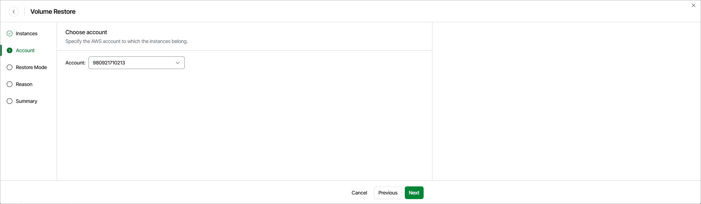

# Step 3. Select Account

At the Account step of the wizard, select the AWS account to which the restored EC2 instances belong. For an AWS account to be displayed in the list of available accounts, it must be included into the tenant as described in section [Adding Tenants](aws_tenant_scope.md).

|  |
| --- |
| Note |
| To perform the backup operation, Veeam Data Cloud for AWS uses the permissions of the IAM role that was created in the AWS account during [CloudFormation template deployment](aws_tenant_connection.md). |

