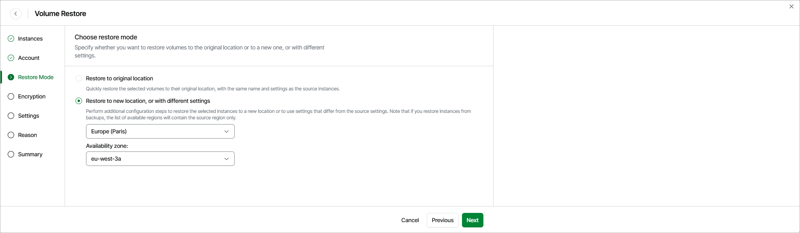

# Step 4. Choose Restore Mode

At the Restore Mode step of the wizard, choose whether you want to restore the selected EBS volumes to the original or to a custom location. If you select the Restore to new location, or with different settings option, specify the AWS Region and Availability Zone to which Veeam Data Cloud for AWS will place the restored EBS volumes.

|  |
| --- |
| Important |
| * If any of the restore options are not available, make sure that the selected restore points meet all the requirements listed at [step 2](aws_restore_volume_restore_point.md) of the wizard. * [Applies only if you select the Restore to new location, or with different settings option] If you restore EBS volumes from image-level backups, the list of available regions will contain the source instance region only. |

