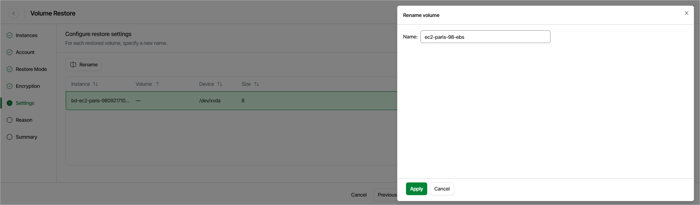

# Step 6. Specify EBS Volume Name

[This step applies only if you have selected the Restore to new location, or with different settings option at the Restore Mode step of the wizard]

At the Settings step of the wizard, you can specify a name for each restored EBS volume:

1. Select the necessary EBS volume and click Rename.
2. In the Rename volume window, specify a name for the restored EBS volume and click Apply.

