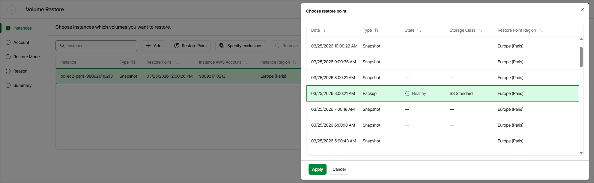

# Step 2. Select Restore Point

At the Instances step of the wizard, you can add EC2 instances to the restore session and select restore points to be used to perform the restore operation for each added instance. By default, Veeam Data Cloud for AWS uses the most recent valid restore point. However, you can restore EBS volumes to an earlier state.

|  |
| --- |
| Tip |
| If you want to restore only specific EBS volumes of the selected EC2 instances, you can exclude the unnecessary disks from the restore process. To do that, click Exclusions to open the Specify exclusions window, select check boxes next to the volumes that you do not want to restore, and click Apply. |

To select a restore point:

1. Select the EC2 instance and click Restore Point.
2. In the Choose restore point window, select the necessary restore point and click Apply.

To help you choose a restore point, Veeam Data Cloud for AWS provides the following information on each available restore point:

* Date — the date when the restore point was created.
* Size — the size of the restore point.
* Type — the type of the restore point:

* Snapshot — a cloud-native snapshot created by a backup policy.
* Backup — an image-level backup created by a backup policy.

* State — the state of the restore point (for image-level backups):

* Healthy — the restore point has been verified by the health check session and reported to be healthy.
* Incomplete — the restore point has been verified by the health check session and reported to be corrupted or incomplete.

* Restore Point Region — an AWS Region where the restore point is stored.

|  |
| --- |
| Important |
| Since Veeam Data Cloud for AWS does not support cross-region copying of EC2 image-level backups, some [restore options](aws_restore_entire_mode.md) may be unavailable. To work around the issue, select either cloud-native snapshots or image-level backups stored in the same AWS Region for all added instances if you plan to restore instances to a new location, or with different settings. Otherwise, Veeam Data Cloud for AWS will be able to restore EBS volumes only to their original location with the source instance settings. |

