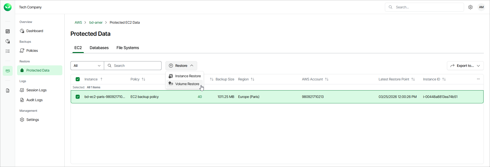

# Step 1. Launch Volume Restore Wizard

To launch the Volume Restore wizard, do the following:

1. On the AWS page, locate a tenant that has access to resources that you want to restore, and click Manage in the Actions column.
2. On the tenant administration page, navigate to Protected Data > EC2.
3. Select the EC2 instance whose EBS volumes you want to restore, and click Restore > Volume Restore.

Alternatively, click the link in the Restore Points column. Then, in the Available Restore Points window, select the necessary restore point and click Restore > Volume Restore.

|  |
| --- |
| Note |
| You can restore EBS volumes of multiple EC2 instances if they belong to same AWS account only. |

