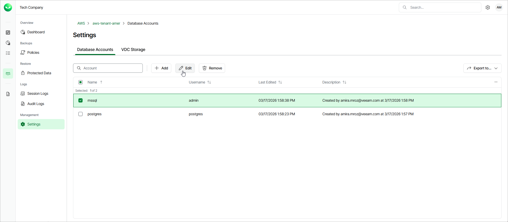

# Editing Database Accounts

For each database account added to Veeam Data Cloud for AWS, you can modify settings configured while adding the account:

1. On the tenant administration page, navigate to Settings > Database Accounts.

1. Select the account and click Edit.
2. Complete the Edit Account wizard.

1. To specify a new name and description for the account, follow the instructions provided in section [Adding Database Accounts](aws_settings_database_account_name.md) (step 2).
2. To modify the credentials that are used to access databases added to backup policies, follow the instructions provided in section [Adding Database Accounts](aws_settings_database_account_password.md) (step 3).
3. At the Summary step of the wizard, review summary information and click Finish to confirm the changes.

