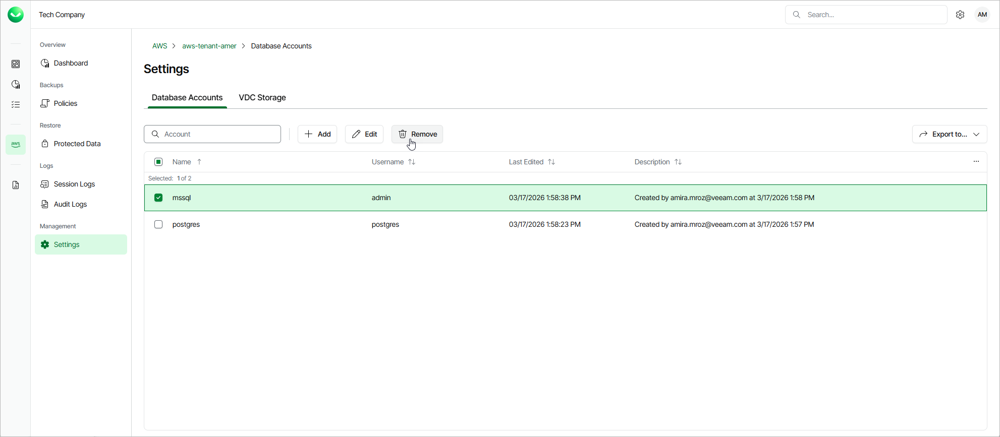

# Removing Database Accounts

Veeam Data Cloud for AWS allows you to permanently remove a database account from the Veeam Data Cloud database if you no longer need it:

1. On the tenant administration page, navigate to Settings > Database Accounts.
2. Select the account and click Remove.

|  |
| --- |
| Important |
| You cannot remove a database account that is associated with any backup policy. Delete all of the affected policies or [edit their settings](aws_settings_accounts_database_edit.md) — and then try removing the account again. |

