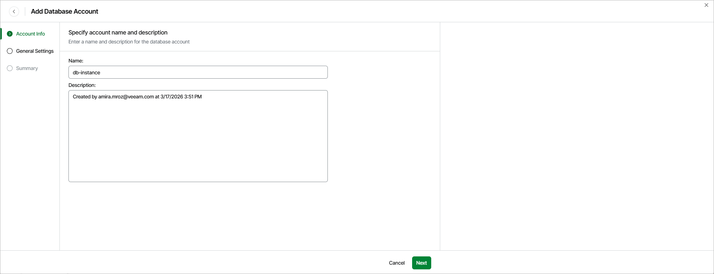

# Step 2. Specify Account Name and Description

At the Account Info step of the wizard, enter a name for the database account and provide a description for future reference. The name must be unique in Veeam Data Cloud for AWS; the maximum length of the name is 127 characters; the maximum length of the description is 1024 characters.

