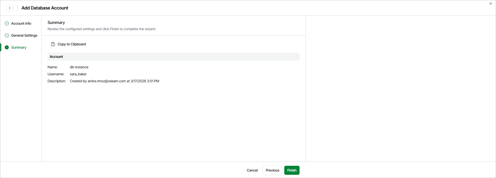

# Step 4. Finish Working with Wizard

At the Summary step of the wizard, review summary information and click Finish.

|  |
| --- |
| Tip |
| After you add the database account, you will be able to specify this account while creating backup policies to allow Veeam Data Cloud for AWS to access source databases. For more information, see [Creating RDS Backup Policies](aws_backup_create_rds_processing_settings.md). |

