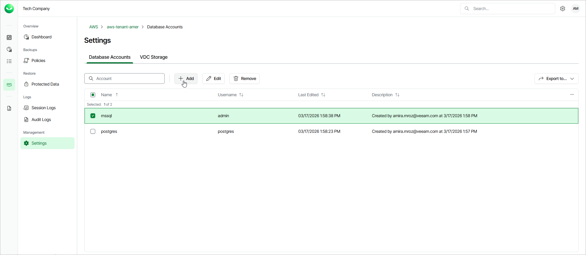

# Step 1. Launch Add Account Wizard

To launch the Add Database Account wizard, do the following:

1. On the AWS page, locate a tenant that has access to DB instances you plan to protect, and click Manage in the Actions column.
2. On the tenant administration page, navigate to Settings > Database Accounts and click Add.

