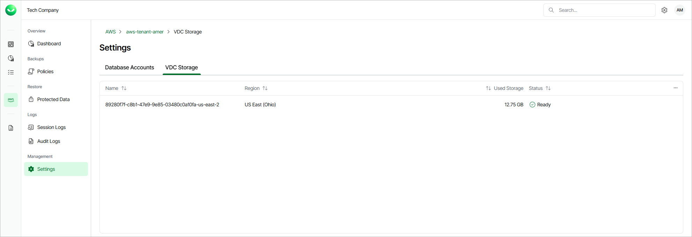

# Viewing Backup Repository Properties

Veeam Data Cloud for AWS uses Amazon S3 buckets as target locations for EC2 and RDS image-level backups. To store backups in Amazon S3 buckets, Veeam Data Cloud for AWS creates backup repositories (specific folders in Amazon S3 buckets) in Veeam-managed AWS accounts within source AWS Regions. Backup repositories are created automatically during initial backup sessions and then added to the product.

To view backup repositories added to your backup infrastructure, do the following:

1. On the AWS page, locate a tenant that has access to resources you backed up, and click Manage in the Actions column.
2. On the tenant administration page, navigate to Settings > VDC Storage.

For each backup repository that is added to Veeam Data Cloud for AWS, the VDC Storage page displays a set of properties, such as:

* Name — the name of the backup repository.
* Region — the AWS Region in which the backup repository resides.
* Used Storage — the amount of storage space that is currently consumed by restore points in the backup repository.
* Status — the current status of the backup repository.

