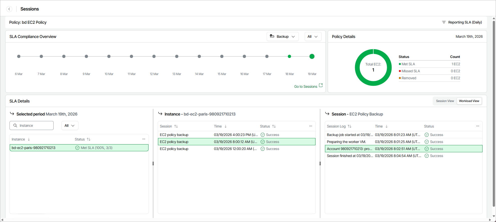

# Monitoring Policy Performance

Veeam Data Cloud for AWS allows you to monitor the protection status of all EC2 instances included into a specific backup policy. As soon as Veeam Data Cloud for AWS finishes all sessions that run during the past 24 hours, the SLA details for that period are automatically added to the SLA Compliance Overview chart on the Sessions page. The chart shows whether the target SLA was met for different types of restore points (snapshots and backups) created by the backup policy.

The number of entries on the SLA Compliance Overview chart depends on the filtering condition (daily, weekly or monthly) that you specify when proceeding to the Sessions page. That is, if you select the Daily condition, the chart will display 14 entries (the past 14 days); if you select the Weekly condition, the chart will display 12 entries (the past 12 weeks); if you select the Monthly condition, the chart will display 12 entries (the past 12 months). To switch between the filtering conditions, click Reporting SLA.

|  |
| --- |
| Note |
| Since time zones of the protected AWS Regions may differ significantly, a new entry is added to the SLA Compliance Overview chart only after Veeam Data Cloud for AWS finishes the last scheduled session in the westernmost region. |

For each entry on the SLA Compliance Overview chart, you can view the following details:

* Policy Details — the number of protected EC2 instances for which the target SLA was met, the number of EC2 instances for which the target SLA was not met, and the number of EC2 instances that were removed from the backup scope during the time period between the currently selected and the next entry on the chart.

|  |
| --- |
| Notes |
| * Veeam Data Cloud for AWS does not estimate SLA compliance for removed EC2 instances. * A EC2 instance is considered removed only if it is removed from the backup scope during the configured data protection window; if it is removed outside this window, no information on that instance will be displayed. |

* SLA Details — the SLA compliance status of protected EC2 instances during the time period between the currently selected and the next entry on the chart.

To view session details for a protected EC2 instance, click the necessary EC2 instance in the list: the Instance section will show the full list of policy sessions that were started during the selected period, as well as their status and duration. To view task details for a policy session, click the necessary session in the list: the Session section will show the full list of tasks that were executed during the selected session, as well as their status and duration.

|  |
| --- |
| Important |
| If you click an EC2 instance in the SLA Details section and some sessions are missing in the Resource section, this can mean either of the following:   * Information on these sessions was removed from the configuration database according to the global retention settings. * Veeam Data Cloud for AWS failed to start these sessions due to technical issues in the production environment. As a workaround, you can view the full list of sessions executed for the backup policy that protects this EC2 instance — to do that, click Go to Sessions under the SLA Compliance Overview chart. |

