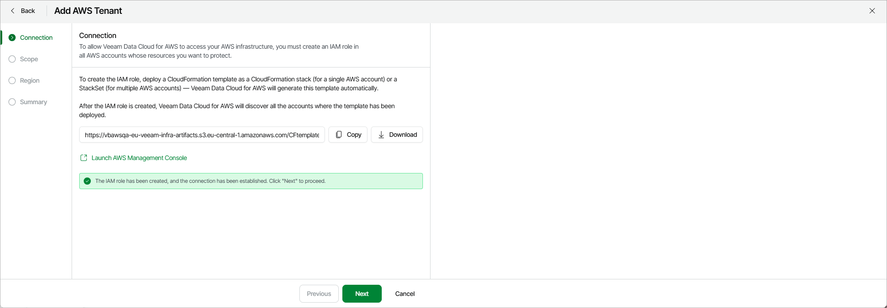

# Step 2. Configure Access to AWS Services and Resources

To be able to access AWS services in your AWS infrastructure, you must create an IAM role in all accounts whose resources you plan to protect. To help you do that, Veeam Data Cloud for AWS automatically generates a CloudFormation template that you can then use to create a CloudFormation stack (for a single AWS account) or a CloudFormation StackSet (for multiple AWS accounts).

|  |
| --- |
| Note |
| The created IAM role will be automatically assigned all the permissions required to perform backup and restore operations. For more information on the required permissions, see [IAM Permissions](aws_permissions.md). |

At the Connection step of the wizard, Veeam Data Cloud for AWS allows you to choose whether you want to manually copy the template URL or to export the template in the CFORM format. In the latter case, Veeam Data Cloud for AWS will save the template as a single file to the default download directory on the local machine.

Alternatively, you can click Launch AWS Management Console to instruct Veeam Data Cloud for AWS to automatically copy the template URL to a new CloudFormation stack. Keep in mind that this option is not supported for CloudFormation StackSets — if you want to create a StackSet, you will have to manually copy the template URL to the new StackSet as described in [AWS Documentation](https://docs.aws.amazon.com/AWSCloudFormation/latest/UserGuide/what-is-cfnstacksets.html).

