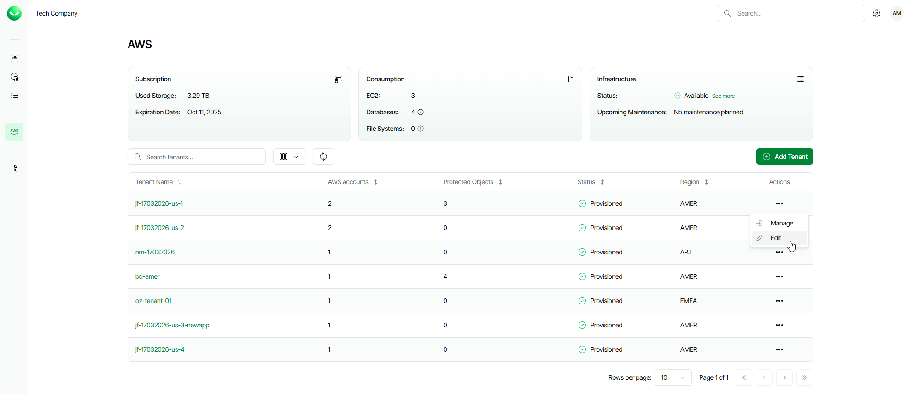

# Editing Tenants

For each tenant created in Veeam Data Cloud for AWS, you can modify settings configured while creating the tenant:

1. On the AWS page, locate the necessary tenant and click > Edit in the Actions column.
2. Complete the Edit AWS Tenant wizard:

1. To provide a new name for the tenant, follow the instructions provided in section [Adding AWS Tenants](aws_tenant_scope.md) (step 3).
2. To allow the tenant to access resources in AWS accounts that have not been included into the tenant yet, follow the instructions provided in section [Adding AWS Tenants](aws_tenant_connection.md) (step 2).
3. To specify new accounts whose resources will be available to the tenant, follow the instructions provided in section [Adding AWS Tenants](aws_tenant_scope.md) (step 3).
4. At the Summary step of the wizard, review summary information and click Finish to confirm the changes.

|  |
| --- |
| Note |
| Currently, Veeam Data Cloud for AWS does not support removing AWS accounts from tenants. |

