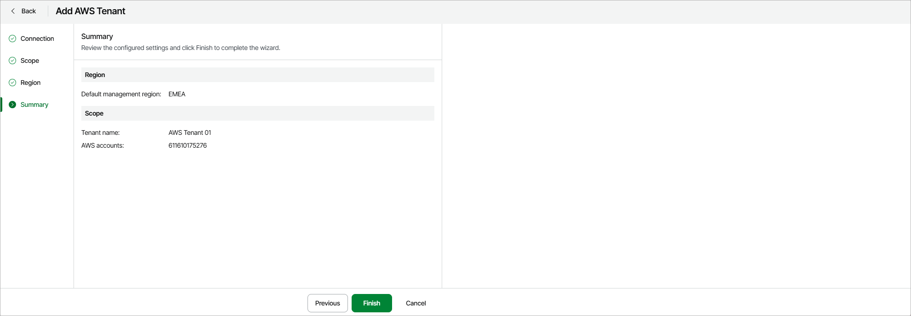

# Step 5. Finish Working with Wizard

At the Summary step of the wizard, review summary information and click Finish.

As soon as you click Finish, Veeam Data Cloud for AWS will start provisioning the tenant and applying the necessary configuration. You can track the progress in the Status column on the AWS page; for more information, see [Viewing Dashboards](aws_dashboard.md#home_page_dashboard).

