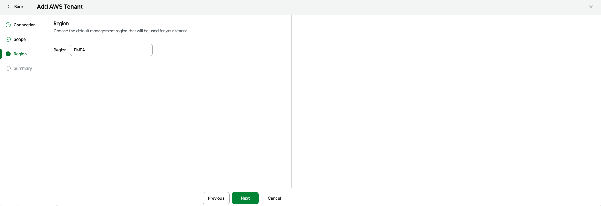

# Step 4. Choose Geographic Location

At the Region step of the wizard, choose a geographic location that Veeam Data Cloud for AWS will use to perform administrative activities (such as coordinating snapshot and backup creation, executing recovery operations and managing retention tasks) for the tenant. The location can be either AMER (N. Virginia), APJ (Sydney) or EMEA (Frankfurt).

