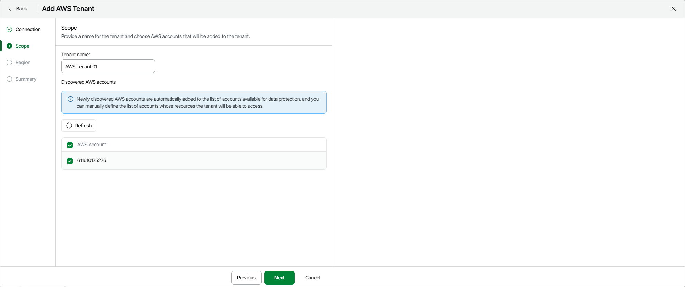

# Step 3. Specify Tenant Name and Accounts

As soon as the CloudFormation template is deployed in your AWS accounts, Veeam Data Cloud for AWS automatically adds the discovered AWS accounts to the list of accounts available for data protection.

At the Scope step of the wizard, enter a name for the new tenant and specify a list of accounts whose resources the tenant will be able to access. The name must be unique in Veeam Data Cloud for AWS; the maximum length of the name is 127 characters; the maximum length of the description is 255 characters.

