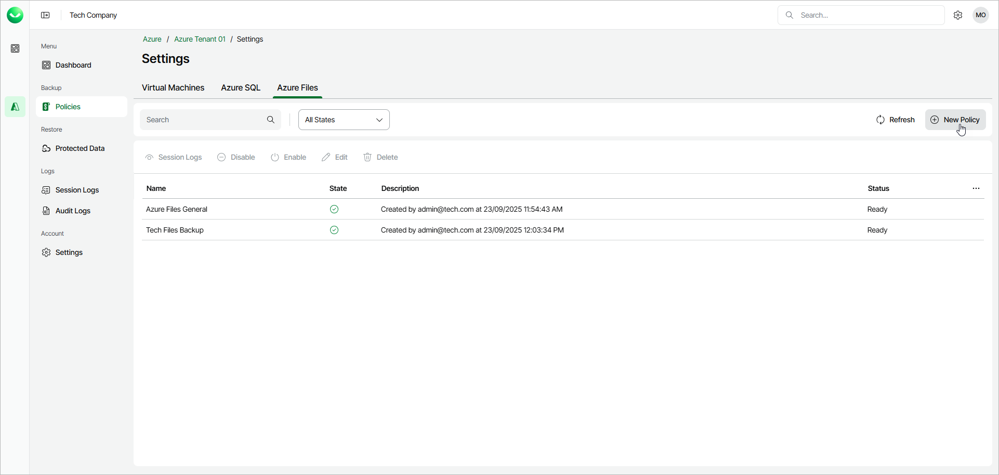

# Step 1. Launch New Azure Files Policy Wizard

In this article

To launch the New Azure File Policy wizard, do the following:

1. In the Backup section of the main menu, select Policies.
2. Select the Azure Files tab and click New Policy.

Page updated 10/15/2025
