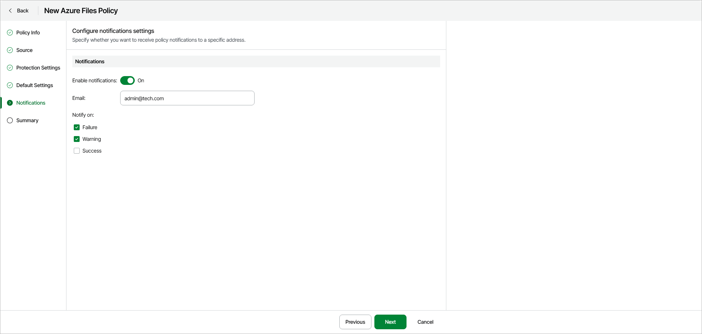

# Step 6. Specify Notification Settings

The Notifications step is available if you have enabled the advanced settings configuration at the [Summary](azure_backup_create_vm_review.md) step of the wizard.

At the Notifications step of the wizard, you can set up notifications about policy completion results. To enable notifications, do the following:

1. Turn on the Enable notifications toggle.
2. In the Email field, specify an email address for notifications.
3. In the Notify on section, you can select what policy session results you want to be notified about — Failure, Warning or Success.

