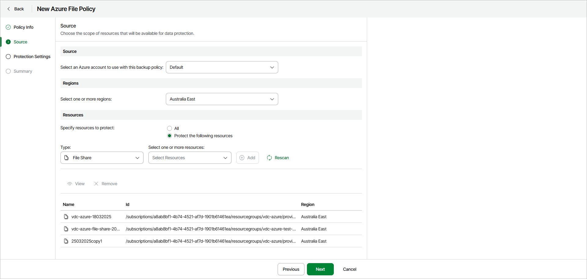

# Step 3. Specify Policy Source

In this article

At the Source step of the wizard, specify an Azure account, region and resources to back up:

1. In the Source section, select an Azure account that has access to Azure resources that you want to protect with the backup policy.
2. In the Regions section, select regions whose resources you want to protect with the backup policy. Click Select All to add all available resources. Click Clear All to clear the selection.
3. In the Resources section, specify file shares that you want to protect with the backup policy:

* Select All if you want to protect all file shares in the selected region.
* Select Protect the following resources if you want to protect specific file shares in the selected region.

1. [For the Protect the following resources option] Specify the following:

1. From the Type drop-down list, choose a selection criteria for the file shares that you want to protect. You can select the following options:

* File Share — select this option if you want to protect specific file shares.
* Resource Group — select this option if you want to protect all file shares from specific resource groups.

1. From the Select one or more resources drop-down list, select resources that you want to protect. Click Add.

After you define the backup scope, you can select a resource and perform the following actions:

* Click View to display detailed resource information.
* Click Remove to remove the resource from the backup policy.

Page updated 10/15/2025
