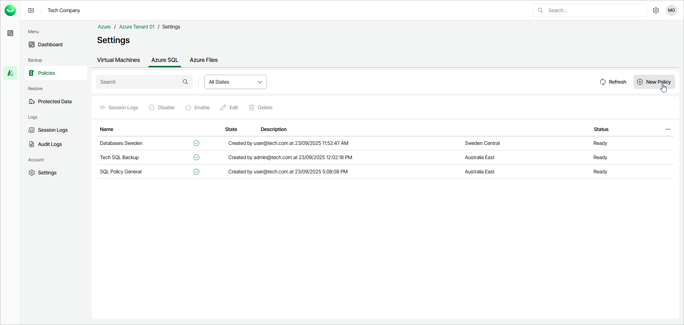

# Step 1. Launch New Azure SQL Policy Wizard

To launch the New Azure SQL Policy wizard, do the following:

1. In the Backup section of the main menu, select Policies.
2. Select the Azure SQL tab and click New Policy.

