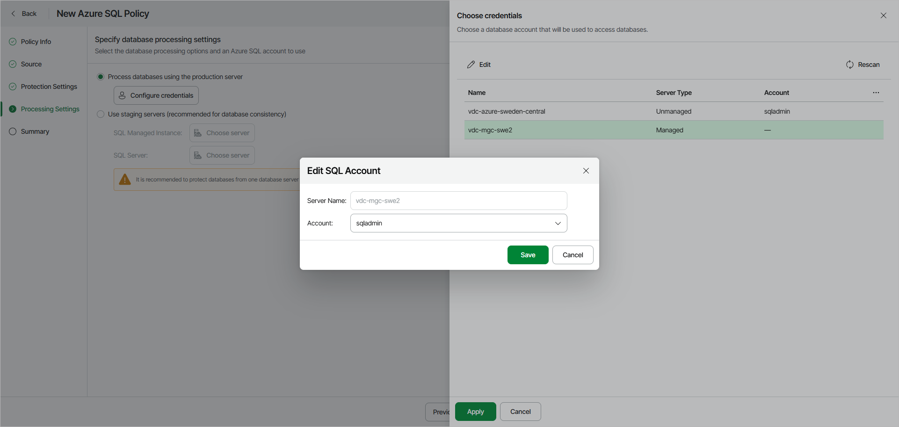
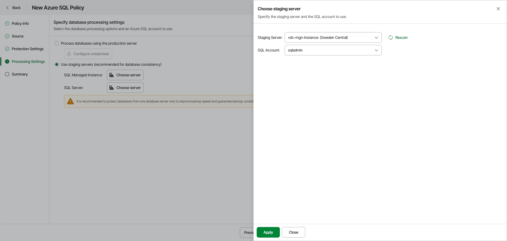

# Step 5. Specify Policy Processing Settings

At the Processing Settings step of the wizard, select the database processing options:

* [Process databases using the production server](#production) — if you select this option, Veeam Data Cloud will create a restore point of the database and transfers it directly to the backup repository. In this case, the database is exported as is, which may result in an inconsistent backup. This process can impact the performance of the production database.
* [Use staging servers](#staging) — if you select this option, Veeam Data Cloud first will copy the database to a staging server, create a restore point, and then transfer it to the backup repository. This process ensures a consistent backup, as the copied database has no active connections and the online database experiences no performance impact during backup. Keep in mind that only one staging server can be used, so if the policy protects databases from multiple servers, all copies will be sent to a single server.

Protecting Databases Without Staging Server

To back up the selected databases without a staging server, do the following:

1. Select the Process databases using the production server option and click Configure Credentials.
2. In the Choose credentials window, for each SQL Server added to the policy, specify an Azure SQL account whose permissions Veeam Data Cloud will use to authenticate against the server:

1. Select a server and click Edit.
2. In the Edit SQL Account window, select the necessary account and click Save.

For an account to be displayed in the Account list, it must be added to Veeam Data Cloud as described in section [Adding Database Account](azure_settings_accounts_database_add.md).

1. Click Apply.

Protecting Databases Using Staging Server

To back up the selected databases using a staging server, do the following:

1. Select Use staging servers.
2. Specify a staging server and account for each type of protected resources. To do that, click Choose server next to the resource type. The available options depend on the resources added at the [Source](azure_backup_create_sql_source.md) step of the wizard:

* SQL Managed Instance — for protecting individual databases within a managed instance.
* SQL Server — for protecting the entire SQL Server.

1. In the Choose staging server window, do the following:

1. From the Staging Server drop-down list, select a SQL Server that will be used to copy the databases. If you plan to back up a database located on an Azure SQL Managed Instance, you must specify the source SQL Server as a staging server.

For a server to be displayed in the Staging server list, it must be added to the Microsoft Azure environment as described in [Microsoft Docs](https://docs.microsoft.com/en-us/azure/azure-sql/database/single-database-manage).

|  |
| --- |
| Important |
| If you use custom Transparent Data Encryption (TDE) to protect SQL Server data, consider that the same Azure Key Vault cryptographic key must be used to encrypt the source and the staging SQL Servers to allow Veeam Data Cloud to perform backup using the Use staging servers option. |

1. From the SQL account drop-down list, select an Azure SQL account whose permissions Veeam Data Cloud will use to authenticate against the staging server.

For an account to be displayed in the SQL Account list, it must be added to Veeam Data Cloud as described in section [Adding Database Account](azure_settings_accounts_database_add.md).

|  |
| --- |
| Important |
| If the Azure SQL account you use to authenticate against the staging server does not have the sysadmin [server-level role](https://learn.microsoft.com/en-us/sql/relational-databases/security/authentication-access/server-level-roles?view=sql-server-ver16) assigned, you can only use the source SQL Server as a staging server — otherwise, the backup operation will fail. |

1. Click Apply.

